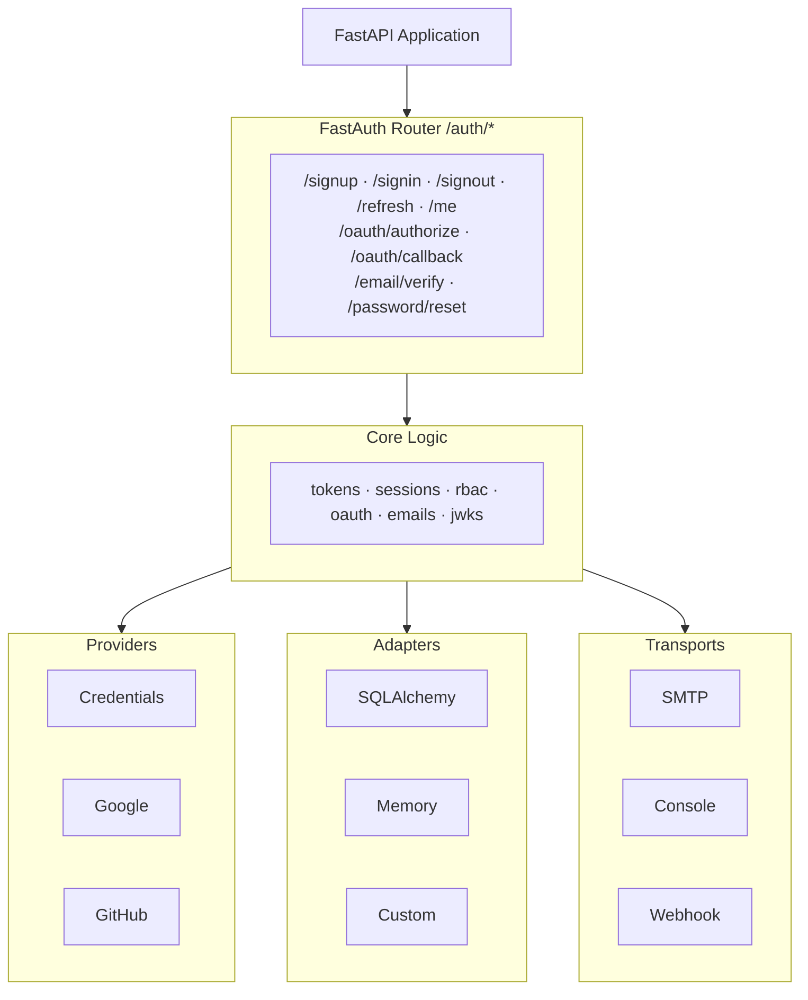
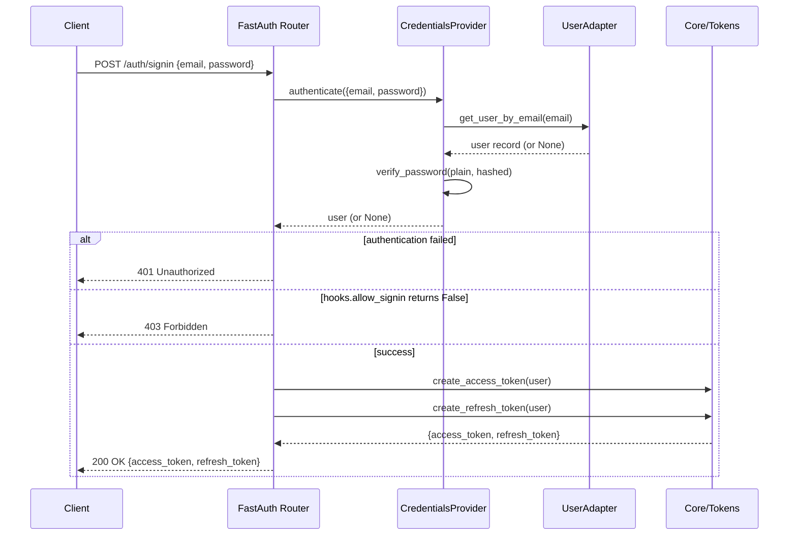
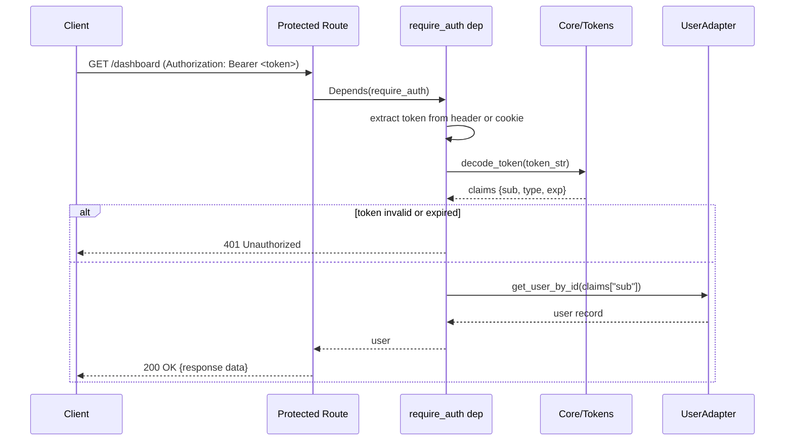

# How it Works

FastAuth is a thin orchestration layer that connects **providers**, **adapters**, and **transports** together under a single FastAPI router.

## Architecture overview

### Layers

| Layer | Responsibility |
|-------|---------------|
| **API (router)** | HTTP endpoints — validates request bodies, calls core logic, returns responses |
| **Core** | Business logic — token creation, session management, RBAC checks |
| **Providers** | Authenticate users — verify a password or exchange an OAuth code |
| **Adapters** | Persist data — read/write users, tokens, sessions, roles in a database |
| **Transports** | Deliver emails — SMTP, webhook, or console (for dev) |

---

## Sign-in flow (credentials)

The sequence below shows what happens when a user posts `{ email, password }` to `/auth/signin`:

---

## Request authentication flow

When a protected route uses `Depends(require_auth)`:

---

## Key design decisions

**Protocol-based (duck typing)** — Every adapter and transport is defined as a Python `Protocol`. You never inherit from a FastAuth base class; you just implement the right methods and pass your object in.

**Async-first** — All adapters, providers, and hooks are `async`. FastAuth works natively with SQLAlchemy's async engine, aioredis, aiosmtplib, and httpx.

**Opt-in features** — Email flows, RBAC, OAuth, JWKS — nothing is enabled unless you configure it. A minimal install has zero runtime dependencies beyond `cuid2` and `pydantic`.
