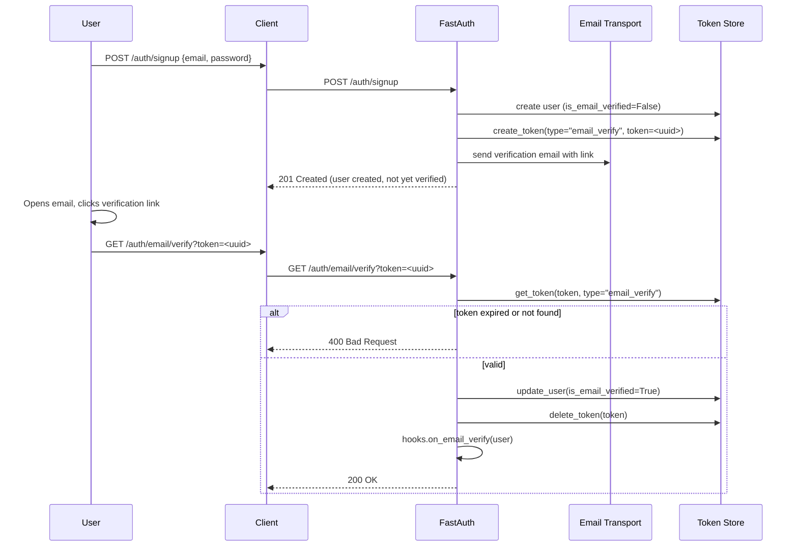

# Email Verification

FastAuth can require users to verify their email address before they can sign in. The flow uses a one-time token stored via `token_adapter` and delivered by `email_transport`.

## Prerequisites

```python
from fastauth.email_transports.console import ConsoleTransport  # dev
# from fastauth.email_transports.smtp import SMTPTransport      # production

config = FastAuthConfig(
    ...,
    token_adapter=adapter.token,          # persists verification tokens
    email_transport=ConsoleTransport(),   # prints link to console in dev
    base_url="https://your-app.com",      # used in the verification link
)
```

## Flow



## Endpoints

| Method | Path | Description |
|--------|------|-------------|
| `POST` | `/auth/email/request-verify` | Re-send the verification email |
| `GET`  | `/auth/email/verify?token=<token>` | Verify the email and activate the account |

## Resend verification email

If the user didn't receive the email:

```bash
curl -X POST http://localhost:8000/auth/email/request-verify \
  -H "Content-Type: application/json" \
  -d '{"email": "alice@example.com"}'
```

## Email transports

| Transport | Install | Use case |
|-----------|---------|---------|
| `ConsoleTransport` | built-in | Development — prints link to stdout |
| `SMTPTransport` | `email` extra | Production SMTP server |
| `WebhookTransport` | built-in | Custom HTTP endpoint / third-party service |

### SMTP

```python
from fastauth.email_transports.smtp import SMTPTransport

transport = SMTPTransport(
    hostname="smtp.sendgrid.net",
    port=587,
    username="apikey",
    password=os.environ["SENDGRID_API_KEY"],
    use_tls=True,
    sender="noreply@example.com",
)
```

## Hook

Override `on_email_verify` to run custom logic after verification:

```python
class MyHooks(EventHooks):
    async def on_email_verify(self, user: UserData) -> None:
        await grant_welcome_credits(user["id"])
```
