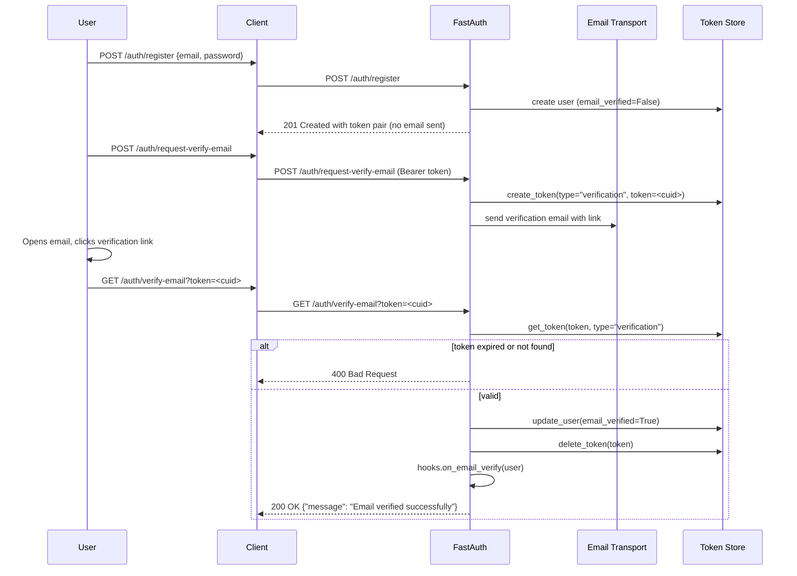

# Email Verification

FastAuth can mark user records as `email_verified` after the user proves they own the address. The flow uses a one-time token stored via `token_adapter` and delivered by `email_transport`.

!!! warning "Registration does **not** send a verification email"
    `POST /auth/register` creates the user with `email_verified=False` and immediately returns a token pair — it does **not** enqueue or send a verification email. To send one, the (now-authenticated) user must explicitly call `POST /auth/request-verify-email`. If you need automatic verification on registration, call `/auth/request-verify-email` from your own code right after `/auth/register` returns, or use the `on_signup` event hook to trigger a verification flow.

!!! note "Credentials login checks `is_active`, not `email_verified`"
    `CredentialsProvider` signs a user in as long as their account is `is_active=True`. It does **not** check `email_verified` — unverified users can still obtain a token pair via `/auth/login`. If your app needs to gate sign-in on verified email, enforce that yourself with the `allow_signin` hook:

    ```python
    from fastauth.core.protocols import EventHooks
    from fastauth.types import UserData

    class RequireVerifiedEmail(EventHooks):
        async def allow_signin(self, user: UserData, provider: str) -> bool:
            return user.get("email_verified", False)
    ```

    The `MagicLinksProvider` similarly checks only `is_active` on the callback. The same `allow_signin` hook above will apply to magic-link sign-ins as well.

## Prerequisites

```python
from fastauth.email_transports.console import ConsoleTransport  # dev
# from fastauth.email_transports.smtp import SMTPTransport      # production

config = FastAuthConfig(
    ...,
    token_adapter=adapter.token,          # persists verification tokens
    email_transport=ConsoleTransport(),   # prints link to console in dev
    base_url="https://your-app.com",      # used in the verification link
)
```

## Flow


```mermaid
sequenceDiagram
    participant U as User
    participant C as Client
    participant FA as FastAuth
    participant E as Email Transport
    participant DB as Token Store

    U->>C: POST /auth/register {email, password}
    C->>FA: POST /auth/register
    FA->>DB: create user (email_verified=False)
    FA-->>C: 201 Created with token pair (no email sent)

    U->>C: POST /auth/request-verify-email
    C->>FA: POST /auth/request-verify-email (Bearer token)
    FA->>DB: create_token(type="verification", token=<cuid>)
    FA->>E: send verification email with link

    U->>U: Opens email, clicks verification link
    U->>C: GET /auth/verify-email?token=<cuid>
    C->>FA: GET /auth/verify-email?token=<cuid>
    FA->>DB: get_token(token, type="verification")
    alt token expired or not found
        FA-->>C: 400 Bad Request
    else valid
        FA->>DB: update_user(email_verified=True)
        FA->>DB: delete_token(token)
        FA->>FA: hooks.on_email_verify(user)
        FA-->>C: 200 OK {"message": "Email verified successfully"}
    end
```

## Endpoints

| Method | Path | Auth required | Description |
|--------|------|:---:|-------------|
| `POST` | `/auth/request-verify-email` | Yes | Generate a verification token and email it to the **authenticated** user |
| `GET`  | `/auth/verify-email?token=<token>` | No | Verify the email and activate the account |
| `POST` | `/auth/verify-email` | No | Verify via body: `{"token": "..."}` |

### Request a verification email

`/auth/request-verify-email` is **explicit and authenticated** — the caller must already hold a valid access token for the user being verified. The endpoint ignores the request body and always sends the email to the address on the authenticated user's record (you cannot ask it to verify a different address).

```bash
curl -X POST http://localhost:8000/auth/request-verify-email \
  -H "Authorization: Bearer <access_token>"
```

If `token_adapter` is not configured, the endpoint returns `400`. If `email_transport` is not configured, the endpoint still creates the verification token in storage (it does not raise), but the email cannot be delivered — configure at least `ConsoleTransport` during development to see the link.

### Verify email

The verification link in the email points to a `GET` endpoint. You can also submit the token via `POST`:

```bash
# Via GET (browser link)
curl http://localhost:8000/auth/verify-email?token=<token-from-email>

# Via POST (API client)
curl -X POST http://localhost:8000/auth/verify-email \
  -H "Content-Type: application/json" \
  -d '{"token": "<token-from-email>"}'
```

Both forms require a valid `token_adapter`; the endpoint returns `400` if it is not configured.

## Email transports

| Transport | Install | Use case |
|-----------|---------|---------|
| `ConsoleTransport` | built-in | Development — prints link to stdout |
| `SMTPTransport` | `email` extra | Production SMTP server |
| `WebhookTransport` | built-in | Custom HTTP endpoint / third-party service |

### SMTP

```python
import os
from fastauth.email_transports.smtp import SMTPTransport

transport = SMTPTransport(
    host="smtp.sendgrid.net",
    port=587,
    username="apikey",
    password=os.environ["SENDGRID_API_KEY"],
    from_email="noreply@example.com",
    use_tls=True,
)
```

## Hook

Override `on_email_verify` to run custom logic after verification:

```python
class MyHooks(EventHooks):
    async def on_email_verify(self, user: UserData) -> None:
        await grant_welcome_credits(user["id"])
```
