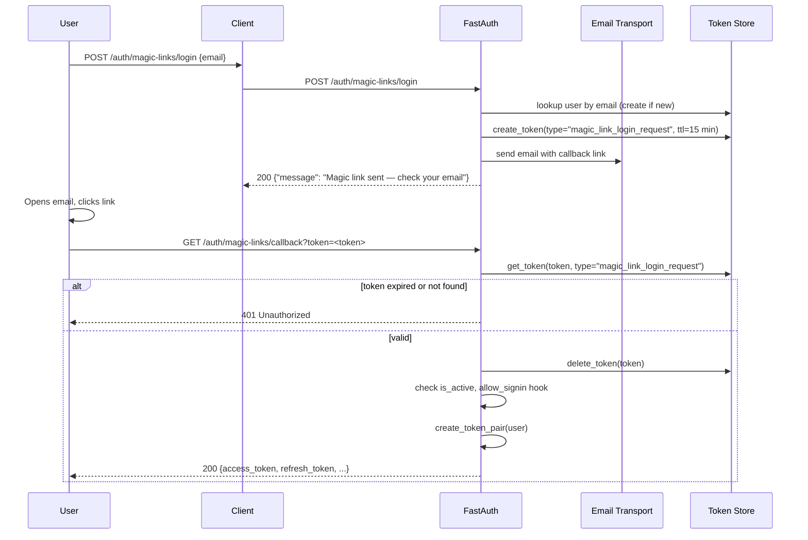

# Magic Links

Passwordless sign-in via a time-limited, one-time link sent to the user's email. No password required — the user clicks the link and receives a token pair.

## Prerequisites

Magic links require a `token_adapter` (to store one-time tokens), an `email_transport` (to deliver the link), and a `base_url` (so the callback URL in the email is correct):

```python
from fastauth import FastAuth, FastAuthConfig
from fastauth.adapters.sqlalchemy import SQLAlchemyAdapter
from fastauth.email_transports.smtp import SMTPTransport
from fastauth.providers.magic_links import MagicLinksProvider

adapter = SQLAlchemyAdapter(engine_url="sqlite+aiosqlite:///./auth.db")

auth = FastAuth(FastAuthConfig(
    secret="change-me-in-production",
    providers=[MagicLinksProvider()],
    adapter=adapter.user,
    token_adapter=adapter.token,      # required
    email_transport=SMTPTransport(    # required
        host="smtp.example.com",
        port=587,
        username="apikey",
        password="...",
        from_email="no-reply@example.com",
    ),
    base_url="https://your-app.com",  # used to build the callback URL in the email
))
```

!!! tip "Development"
    Use `ConsoleTransport` during development — it prints the link to stdout instead of sending an email.

    ```python
    from fastauth.email_transports.console import ConsoleTransport

    email_transport=ConsoleTransport()
    ```

## Flow



## Endpoints

| Method | Path | Auth required | Description |
|--------|------|:---:|-------------|
| `POST` | `/auth/magic-links/login` | No | Request a magic link email |
| `GET`  | `/auth/magic-links/callback?token=<token>` | No | Exchange token for a token pair |

The router is only mounted when `MagicLinksProvider` is present in `config.providers`.

## Login

```http
POST /auth/magic-links/login
Content-Type: application/json

{"email": "alice@example.com"}
```

Response (`200 OK`):

```json
{"message": "Magic link sent — check your email"}
```

**Auto-registration:** if no user exists with this email, one is created automatically (no password set). This makes magic links suitable as a standalone auth method — no separate registration step needed.

The response is always `200` regardless of whether the email address is registered, to avoid leaking which emails are in the system.

## Callback

The link in the email resolves to:

```
GET /auth/magic-links/callback?token=<token>
```

Response (`200 OK`) — same shape as `/auth/login`:

```json
{
  "access_token": "eyJ...",
  "refresh_token": "eyJ...",
  "token_type": "bearer",
  "expires_in": 900
}
```

The token is **one-time use** and deleted immediately after it is verified. Replaying the same link returns `401`.

Error responses:

| Status | Cause |
|--------|-------|
| `401` | Token not found, expired, or already used |
| `401` | User account is inactive |
| `403` | `allow_signin` hook returned `False` |

## Token expiry

The default link lifetime is **15 minutes**. Adjust with `max_age` (seconds):

```python
MagicLinksProvider(max_age=30 * 60)  # 30 minutes
```

## Email transports

| Transport | Install | Use case |
|-----------|---------|---------|
| `ConsoleTransport` | built-in | Development — prints link to stdout |
| `SMTPTransport` | `email` extra | Production SMTP server |
| `WebhookTransport` | built-in | Custom HTTP endpoint / third-party service |

See [Email Verification](email-verification.md#email-transports) for configuration details — all transports work the same way.

## Combining with credentials

`MagicLinksProvider` can be listed alongside `CredentialsProvider` — both routes work independently:

```python
providers=[
    CredentialsProvider(),
    MagicLinksProvider(),
],
```

## Cookie delivery

When `token_delivery="cookie"` is set, the callback endpoint sets `access_token` and `refresh_token` as HTTP-only cookies instead of returning them in the JSON body. This is useful for browser-based apps where the callback URL is opened directly in a tab.

```python
FastAuthConfig(
    ...
    token_delivery="cookie",
)
```

## Event hooks

```python
from fastauth.core.protocols import EventHooks
from fastauth.types import UserData

class MyHooks(EventHooks):
    async def allow_signin(self, user: UserData, provider: str) -> bool:
        if provider == "magic_link":
            return user.get("email_verified", False)
        return True

    async def on_signin(self, user: UserData, provider: str) -> None:
        if provider == "magic_link":
            await record_login(user["id"])
```

The `provider` argument is `"magic_link"` for magic link sign-ins.

## Security notes

- Tokens are single-use and deleted on first use.
- The default TTL is 15 minutes. Use the shortest TTL your UX allows.
- The `/login` endpoint always returns `200` regardless of whether the email exists (enumeration protection).
- Use `token_adapter` backed by a persistent store (SQLAlchemy, Redis) in production so tokens survive server restarts.
- Set `base_url` to your production domain so callback links point to the right host.
