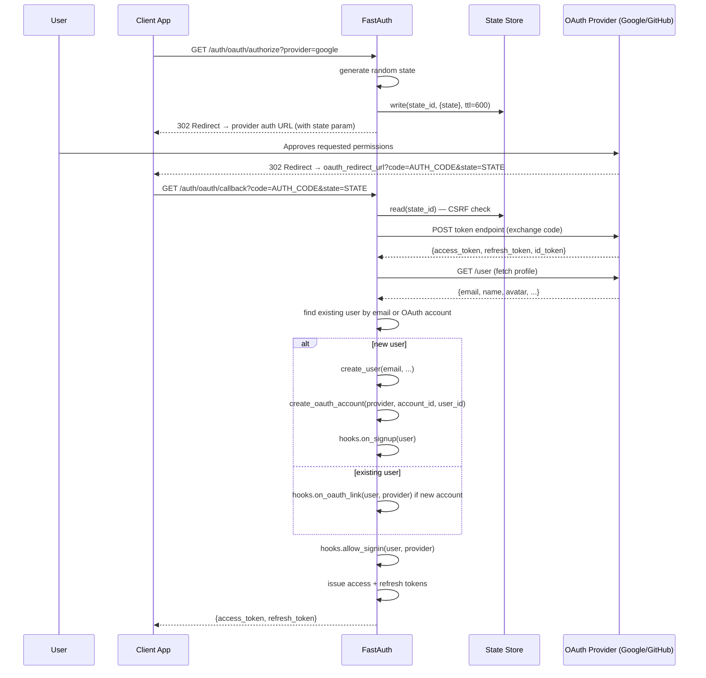

# OAuth Flow

FastAuth implements the OAuth 2.0 Authorization Code flow with CSRF protection via a random `state` parameter.

## How it works



## Configuration

```python
from fastauth.session_backends.memory import MemorySessionBackend
from fastauth.providers.google import GoogleProvider
from fastauth.providers.github import GitHubProvider

config = FastAuthConfig(
    providers=[
        GoogleProvider(client_id="...", client_secret="..."),
        GitHubProvider(client_id="...", client_secret="..."),
    ],
    oauth_adapter=adapter.oauth,           # persist linked accounts
    oauth_state_store=MemorySessionBackend(),  # store CSRF state
    oauth_redirect_url="https://your-app.com/auth/oauth/callback",
    ...
)
```

## Endpoints

| Method | Path | Description |
|--------|------|-------------|
| `GET` | `/auth/oauth/authorize?provider=<id>` | Start the OAuth flow (redirects to provider) |
| `GET` | `/auth/oauth/callback?code=...&state=...` | Handle the provider callback |

## CSRF protection

FastAuth generates a cryptographically random `state` value before each OAuth redirect, stores it in `oauth_state_store` with a 10-minute TTL, and verifies it when the provider redirects back. If the state is missing or doesn't match, the request is rejected with 400.

Use `RedisSessionBackend` in production so state survives across multiple app instances:

```python
from fastauth.session_backends.redis import RedisSessionBackend

config = FastAuthConfig(
    ...,
    oauth_state_store=RedisSessionBackend(url="redis://localhost:6379"),
)
```

## Account linking

When a user logs in via OAuth and a local user with the same email already exists, FastAuth links the OAuth account to the existing user and calls `hooks.on_oauth_link`. No duplicate user is created.
