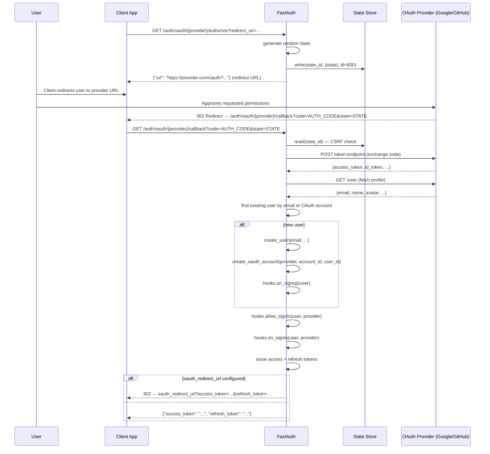

# OAuth Flow

FastAuth implements the OAuth 2.0 Authorization Code flow with CSRF protection via a random `state` parameter.

## How it works


```mermaid
sequenceDiagram
    participant U as User
    participant C as Client App
    participant FA as FastAuth
    participant SS as State Store
    participant P as OAuth Provider (Google/GitHub)

    C->>FA: GET /auth/oauth/{provider}/authorize?redirect_uri=...
    FA->>FA: generate random state
    FA->>SS: write(state_id, {state}, ttl=600)
    FA-->>C: {"url": "https://provider.com/oauth?..."} (redirect URL)

    U->>C: Client redirects user to provider URL
    U->>P: Approves requested permissions
    P-->>C: 302 Redirect → /auth/oauth/{provider}/callback?code=AUTH_CODE&state=STATE

    C->>FA: GET /auth/oauth/{provider}/callback?code=AUTH_CODE&state=STATE
    FA->>SS: read(state_id) — CSRF check
    FA->>P: POST token endpoint (exchange code)
    P-->>FA: {access_token, id_token, ...}
    FA->>P: GET /user (fetch profile)
    P-->>FA: {email, name, avatar, ...}

    FA->>FA: find existing user by email or OAuth account
    alt new user
        FA->>FA: create_user(email, ...)
        FA->>FA: create_oauth_account(provider, account_id, user_id)
        FA->>FA: hooks.on_signup(user)
    end

    FA->>FA: hooks.allow_signin(user, provider)
    FA->>FA: hooks.on_signin(user, provider)
    FA->>FA: issue access + refresh tokens

    alt oauth_redirect_url configured
        FA-->>C: 302 → oauth_redirect_url?access_token=...&refresh_token=...
    else
        FA-->>C: {"access_token": "...", "refresh_token": "..."}
    end
```

## Configuration

```python
from fastauth.session_backends.memory import MemorySessionBackend
from fastauth.providers.google import GoogleProvider
from fastauth.providers.github import GitHubProvider

config = FastAuthConfig(
    providers=[
        GoogleProvider(client_id="...", client_secret="..."),
        GitHubProvider(client_id="...", client_secret="..."),
    ],
    oauth_adapter=adapter.oauth,                # persist linked accounts
    oauth_state_store=MemorySessionBackend(),   # store CSRF state
    oauth_redirect_url="https://your-app.com/auth/callback",  # optional frontend redirect
    ...
)
```

## Endpoints

| Method | Path | Description |
|--------|------|-------------|
| `GET` | `/auth/oauth/{provider}/authorize?redirect_uri=<uri>` | Start the OAuth flow — returns `{"url": "..."}` |
| `GET` | `/auth/oauth/{provider}/callback?code=...&state=...` | Handle the provider callback |
| `GET` | `/auth/oauth/accounts` | List the current user's linked OAuth accounts |
| `DELETE` | `/auth/oauth/accounts/{provider}` | Unlink an OAuth account |

The `{provider}` path parameter is the provider's ID: `google` or `github`.

### Start the OAuth flow

```bash
curl "http://localhost:8000/auth/oauth/google/authorize?redirect_uri=http://localhost:8000/auth/oauth/google/callback"
```

Response:

```json
{
  "url": "https://accounts.google.com/o/oauth2/v2/auth?client_id=...&state=..."
}
```

Redirect the user's browser to this URL.

### List linked accounts

```bash
curl http://localhost:8000/auth/oauth/accounts \
  -H "Authorization: Bearer <access_token>"
```

Response:

```json
[
  {"provider": "google", "provider_account_id": "12345"}
]
```

### Unlink an account

```bash
curl -X DELETE http://localhost:8000/auth/oauth/accounts/google \
  -H "Authorization: Bearer <access_token>"
```

## CSRF protection

FastAuth generates a cryptographically random `state` value before each OAuth redirect, stores it in `oauth_state_store` with a 10-minute TTL, and verifies it when the provider redirects back. If the state is missing or doesn't match, the request is rejected with 400.

Use `RedisSessionBackend` in production so state survives across multiple app instances:

```python
from fastauth.session_backends.redis import RedisSessionBackend

config = FastAuthConfig(
    ...,
    oauth_state_store=RedisSessionBackend(url="redis://localhost:6379"),
)
```

## Handling the callback response

If `oauth_redirect_url` is set in your config, FastAuth redirects to it after a successful OAuth callback, appending tokens as query parameters:

```
GET https://your-app.com/auth/callback?access_token=eyJ...&refresh_token=eyJ...&token_type=bearer&expires_in=900
```

Your frontend can extract these tokens and store them. If `oauth_redirect_url` is not set, the tokens are returned as a JSON body instead.

## Account linking

When a user logs in via OAuth and a local user with the same email already exists, FastAuth links the OAuth account to the existing user and calls `hooks.on_oauth_link`. No duplicate user is created.
