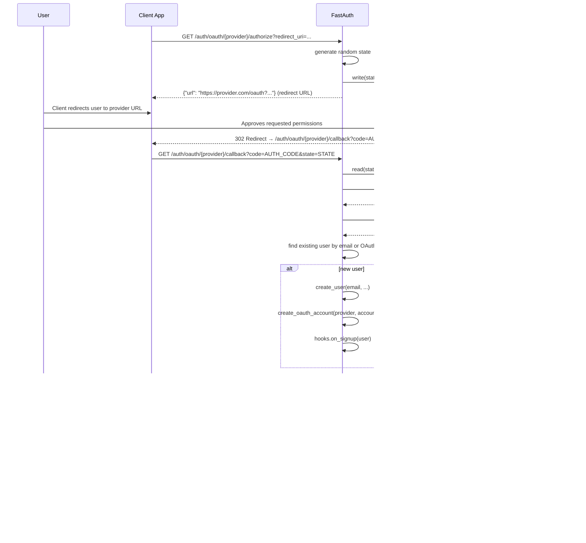

# OAuth Flow

FastAuth implements the OAuth 2.0 Authorization Code flow with CSRF protection via a random `state` parameter.

## How it works


```mermaid
sequenceDiagram
    participant U as User
    participant C as Client App
    participant FA as FastAuth
    participant SS as State Store
    participant P as OAuth Provider (Google/GitHub)

    C->>FA: GET /auth/oauth/{provider}/authorize?redirect_uri=...
    FA->>FA: generate random state
    FA->>SS: write(state_id, {state}, ttl=600)
    FA-->>C: {"url": "https://provider.com/oauth?..."} (redirect URL)

    U->>C: Client redirects user to provider URL
    U->>P: Approves requested permissions
    P-->>C: 302 Redirect → /auth/oauth/{provider}/callback?code=AUTH_CODE&state=STATE

    C->>FA: GET /auth/oauth/{provider}/callback?code=AUTH_CODE&state=STATE
    FA->>SS: read(state_id) — CSRF check
    FA->>P: POST token endpoint (exchange code)
    P-->>FA: {access_token, id_token, ...}
    FA->>P: GET /user (fetch profile)
    P-->>FA: {email, name, avatar, ...}

    FA->>FA: find existing user by email or OAuth account
    alt new user
        FA->>FA: create_user(email, ...)
        FA->>FA: create_oauth_account(provider, account_id, user_id)
        FA->>FA: hooks.on_signup(user)
    end

    FA->>FA: hooks.allow_signin(user, provider)
    FA->>FA: hooks.on_signin(user, provider)
    FA->>FA: issue access + refresh tokens

    alt oauth_redirect_url configured
        FA-->>C: 302 → oauth_redirect_url (tokens set as HttpOnly cookies)
    else
        FA-->>C: {"access_token": "...", "refresh_token": "..."}
    end
```

## Configuration

```python
from fastauth.session_backends.memory import MemorySessionBackend
from fastauth.providers.google import GoogleProvider
from fastauth.providers.github import GitHubProvider

config = FastAuthConfig(
    providers=[
        GoogleProvider(client_id="...", client_secret="..."),
        GitHubProvider(client_id="...", client_secret="..."),
    ],
    oauth_adapter=adapter.oauth,                # persist linked accounts
    oauth_state_store=MemorySessionBackend(),   # store CSRF state
    oauth_redirect_url="https://your-app.com/auth/callback",  # optional frontend redirect
    ...
)
```

## Endpoints

| Method | Path | Description |
|--------|------|-------------|
| `GET` | `/auth/oauth/{provider}/authorize?redirect_uri=<uri>` | Start the OAuth flow — returns `{"url": "..."}` |
| `GET` | `/auth/oauth/{provider}/callback?code=...&state=...` | Handle the provider callback |
| `GET` | `/auth/oauth/accounts` | List the current user's linked OAuth accounts |
| `DELETE` | `/auth/oauth/accounts/{provider}` | Unlink an OAuth account |

The `{provider}` path parameter is the provider's ID: `google` or `github`.

### Start the OAuth flow

```bash
curl "http://localhost:8000/auth/oauth/google/authorize?redirect_uri=http://localhost:8000/auth/oauth/google/callback"
```

Response:

```json
{
  "url": "https://accounts.google.com/o/oauth2/v2/auth?client_id=...&state=..."
}
```

Redirect the user's browser to this URL.

### List linked accounts

```bash
curl http://localhost:8000/auth/oauth/accounts \
  -H "Authorization: Bearer <access_token>"
```

Response:

```json
[
  {"provider": "google", "provider_account_id": "12345"}
]
```

### Unlink an account

```bash
curl -X DELETE http://localhost:8000/auth/oauth/accounts/google \
  -H "Authorization: Bearer <access_token>"
```

## CSRF protection

FastAuth generates a cryptographically random `state` value before each OAuth redirect, stores it in `oauth_state_store` with a 10-minute TTL, and verifies it when the provider redirects back. If the state is missing or doesn't match, the request is rejected with 400.

Use `RedisSessionBackend` in production so state survives across multiple app instances:

```python
from fastauth.session_backends.redis import RedisSessionBackend

config = FastAuthConfig(
    ...,
    oauth_state_store=RedisSessionBackend(url="redis://localhost:6379"),
)
```

## Handling the callback response

If `oauth_redirect_url` is set in your config, FastAuth redirects to it after a successful OAuth callback. Tokens are set as `HttpOnly` cookies on the redirect response instead of being appended to the URL:

```
GET https://your-app.com/auth/callback
Set-Cookie: access_token=...; HttpOnly; Secure; SameSite=Lax
Set-Cookie: refresh_token=...; HttpOnly; Secure; SameSite=Lax
```

If `oauth_redirect_url` is not set, the tokens are returned as a JSON body — unless `token_delivery="cookie"`, in which case the response body intentionally contains no token material and the tokens live entirely in the `HttpOnly` cookies.

!!! warning "Avoid reading tokens from the URL"
    Tokens must not be placed in redirect query parameters because they can be exposed through browser history, logs, screenshots, and `Referer` headers. Always rely on `HttpOnly` cookies (or a server-side exchange) when using `oauth_redirect_url`.

## `redirect_uri` vs `oauth_redirect_url`

These two settings are different and easy to confuse:

| Setting | Where it lives | Purpose |
|---------|---------------|---------|
| `redirect_uri` (query param) | `/auth/oauth/{provider}/authorize?redirect_uri=...` | The **OAuth provider callback URL** registered with the provider (e.g. `https://api.example.com/auth/oauth/google/callback`). This is the URL the provider redirects to with `code` + `state`. |
| `oauth_redirect_url` (config) | `FastAuthConfig(..., oauth_redirect_url="...")` | The **frontend URL** FastAuth redirects to *after* a successful callback, with tokens as `HttpOnly` cookies. Optional. |

When the OAuth flow starts, FastAuth binds the `redirect_uri` to the CSRF state. On the callback, FastAuth uses the **bound** value when calling `provider.exchange_code` — a different value passed in the request URL is ignored. This prevents an attacker from tricking the application into exchanging a code at an attacker-controlled URL.

## State validation

The CSRF state is validated against three things on every callback:

1. **Presence** — state must exist in `oauth_state_store` and not be expired.
2. **Provider match** — the stored `provider` must equal `provider.id` of the configured OAuth provider handling the callback. A state created for one provider cannot be redeemed by another.
3. **Redirect URI** — the stored `redirect_uri` must be present; otherwise the callback is rejected.

A failed match returns HTTP `400`.

## Account linking

When a user logs in via OAuth and a local user with the same email already exists, FastAuth only links the OAuth account to that existing user if the provider reports the email as verified. This prevents an unverified provider email from taking over a local account that uses the same address.

If the provider email is not verified and no local user exists yet, FastAuth can create a new user, but the user's `email_verified` field remains `False`. Already-linked OAuth accounts can continue to sign in by provider account ID; an unverified provider email will not upgrade the local `email_verified` flag.

The `OAuthAccountAdapter` stores `provider` + `provider_account_id` and the SQLAlchemy adapter enforces a database-level unique constraint on that pair. A duplicate `create_oauth_account(...)` call is treated as "already linked" and returns the existing record instead of raising a constraint error.

### `on_oauth_link` hook

`on_oauth_link` is fired **only** for explicit link flows — i.e. after `/auth/oauth/{provider}/link/callback` succeeds. Normal OAuth sign-in via `/auth/oauth/{provider}/callback` does **not** fire `on_oauth_link`; it fires `on_signin` (and `on_signup` for new users). This avoids the misleading semantics of treating a fresh sign-in as an "account linked" event.

If `allow_signin` denies a sign-in, FastAuth responds with `403` and:

- No tokens are issued
- `on_signin` is **not** fired
- `on_oauth_link` is **not** fired
- No refresh-token JTI is recorded

## Provider token storage

By default FastAuth does **not** persist the OAuth provider's access or refresh token. Stored provider tokens expand the blast radius of a database compromise and are not currently used by FastAuth itself.

To opt in to storing provider tokens (for example, if you build custom logic that calls provider APIs on behalf of the user), set:

```python
config = FastAuthConfig(
    ...,
    store_oauth_provider_tokens=True,
)
```
