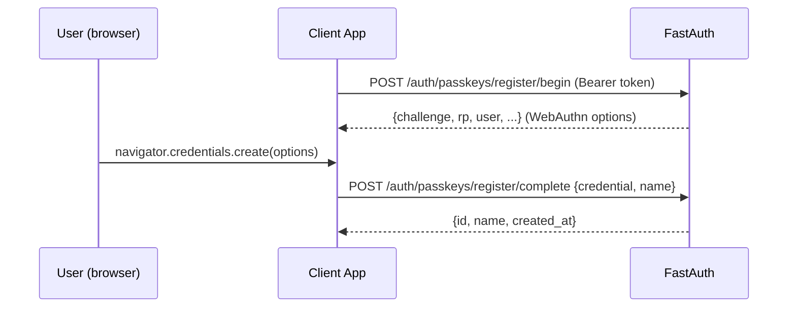
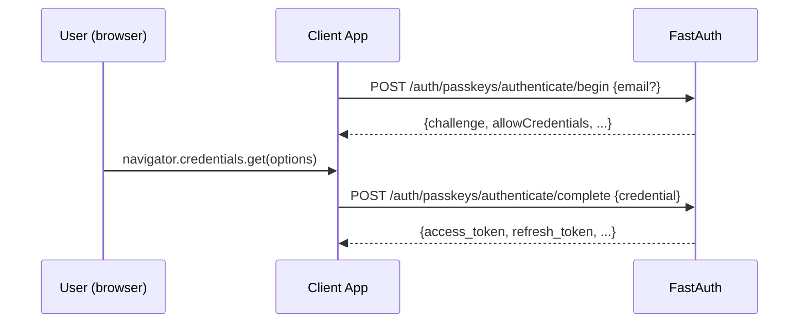

# Passkeys (WebAuthn)

Let users sign in with Touch ID, Face ID, Windows Hello, or a hardware security key — no password needed.

## Prerequisites

```bash
pip install "sreekarnv-fastauth[standard,webauthn]"
```

## Setup

```python
from fastauth import FastAuth, FastAuthConfig
from fastauth.adapters.sqlalchemy import SQLAlchemyAdapter
from fastauth.providers.passkey import PasskeyProvider
from fastauth.session_backends.memory import MemorySessionBackend

adapter = SQLAlchemyAdapter(engine_url="sqlite+aiosqlite:///./auth.db")

auth = FastAuth(FastAuthConfig(
    secret="change-me-in-production",
    providers=[
        PasskeyProvider(
            rp_id="example.com",          # domain only, no scheme
            rp_name="My App",
            origin="https://example.com", # full origin (scheme + host)
        ),
    ],
    adapter=adapter.user,
    passkey_adapter=adapter.passkey,
    passkey_state_store=MemorySessionBackend(),  # or RedisSessionBackend
))
```

`rp_id` must match the domain of the page performing the ceremony. `origin` must match the full origin (`scheme://host[:port]`).

Multiple origins (e.g. dev + prod):

```python
PasskeyProvider(
    rp_id="example.com",
    rp_name="My App",
    origin=["https://example.com", "http://localhost:5173"],
)
```

## Endpoints

| Method | Path | Auth required | Description |
|---|---|---|---|
| `POST` | `/auth/passkeys/register/begin` | yes | Start passkey registration |
| `POST` | `/auth/passkeys/register/complete` | yes | Finish passkey registration |
| `GET` | `/auth/passkeys` | yes | List this user's passkeys |
| `DELETE` | `/auth/passkeys/{id}` | yes | Remove a passkey |
| `POST` | `/auth/passkeys/authenticate/begin` | no | Start passkey sign-in |
| `POST` | `/auth/passkeys/authenticate/complete` | no | Finish passkey sign-in, get tokens |

## Registration flow

A user must be signed in (via credentials or OAuth) to register a passkey.



### Begin registration

```http
POST /auth/passkeys/register/begin
Authorization: Bearer <access_token>
```

Response: WebAuthn `PublicKeyCredentialCreationOptions` as JSON. Pass directly to `navigator.credentials.create()`.

### Complete registration

```http
POST /auth/passkeys/register/complete
Authorization: Bearer <access_token>
Content-Type: application/json

{
  "credential": { ...output of navigator.credentials.create()... },
  "name": "MacBook Touch ID"
}
```

Response (201):

```json
{
  "id": "Ab3xQ...",
  "name": "MacBook Touch ID",
  "created_at": "2024-01-15T10:30:00+00:00"
}
```

### Client-side example

```js
import { startRegistration } from "@simplewebauthn/browser";

async function registerPasskey(accessToken, name) {
  const optRes = await fetch("/auth/passkeys/register/begin", {
    headers: { Authorization: `Bearer ${accessToken}` },
  });
  const options = await optRes.json();

  const credential = await startRegistration(options);

  const res = await fetch("/auth/passkeys/register/complete", {
    method: "POST",
    headers: {
      "Content-Type": "application/json",
      Authorization: `Bearer ${accessToken}`,
    },
    body: JSON.stringify({ credential, name }),
  });
  return res.json();
}
```

## Authentication flow



### Begin authentication

```http
POST /auth/passkeys/authenticate/begin
Content-Type: application/json

{ "email": "user@example.com" }
```

Providing `email` filters `allowCredentials` to that user's registered passkeys. Omit it for a discoverable credential (residents key) flow where the authenticator picks the account.

### Complete authentication

```http
POST /auth/passkeys/authenticate/complete
Content-Type: application/json

{ "credential": { ...output of navigator.credentials.get()... } }
```

Response mirrors `/auth/login`:

```json
{
  "access_token": "eyJ...",
  "refresh_token": "eyJ...",
  "token_type": "bearer",
  "expires_in": 900
}
```

### Client-side example

```js
import { startAuthentication } from "@simplewebauthn/browser";

async function signInWithPasskey(email) {
  const optRes = await fetch("/auth/passkeys/authenticate/begin", {
    method: "POST",
    headers: { "Content-Type": "application/json" },
    body: JSON.stringify({ email }),
  });
  const options = await optRes.json();

  const credential = await startAuthentication(options);

  const res = await fetch("/auth/passkeys/authenticate/complete", {
    method: "POST",
    headers: { "Content-Type": "application/json" },
    body: JSON.stringify({ credential }),
  });
  return res.json(); // { access_token, refresh_token, ... }
}
```

## Managing passkeys

### List passkeys

```http
GET /auth/passkeys
Authorization: Bearer <access_token>
```

```json
[
  {
    "id": "Ab3xQ...",
    "name": "MacBook Touch ID",
    "aaguid": "adce0002-35bc-c60a-648b-0b25f1f05503",
    "created_at": "2024-01-15T10:30:00+00:00",
    "last_used_at": "2024-02-01T08:12:00+00:00"
  }
]
```

### Delete a passkey

```http
DELETE /auth/passkeys/{id}
Authorization: Bearer <access_token>
```

Returns `204 No Content`.

## Combining with credentials

`PasskeyProvider` can be listed alongside `CredentialsProvider` — both will work independently:

```python
providers=[
    CredentialsProvider(),
    PasskeyProvider(rp_id="example.com", rp_name="My App", origin="https://example.com"),
],
```

## Event hooks

```python
from fastauth.core.protocols import EventHooks
from fastauth.types import PasskeyData, UserData

class MyHooks(EventHooks):
    async def on_passkey_registered(self, user: UserData, passkey: PasskeyData) -> None:
        print(f"{user['email']} registered passkey: {passkey['name']}")

    async def on_passkey_deleted(self, user: UserData, passkey: PasskeyData) -> None:
        print(f"{user['email']} removed passkey: {passkey['name']}")
```

## Security notes

- Keep `rp_id` set to your exact domain. Never use a parent domain unless intentional.
- `passkey_state_store` holds challenges with a 5-minute TTL. Use `RedisSessionBackend` in production.
- The sign count is verified on every authentication to detect cloned authenticators. A mismatch raises an error.
- `origin` must include the port for non-standard ports, e.g. `"http://localhost:8000"`.
