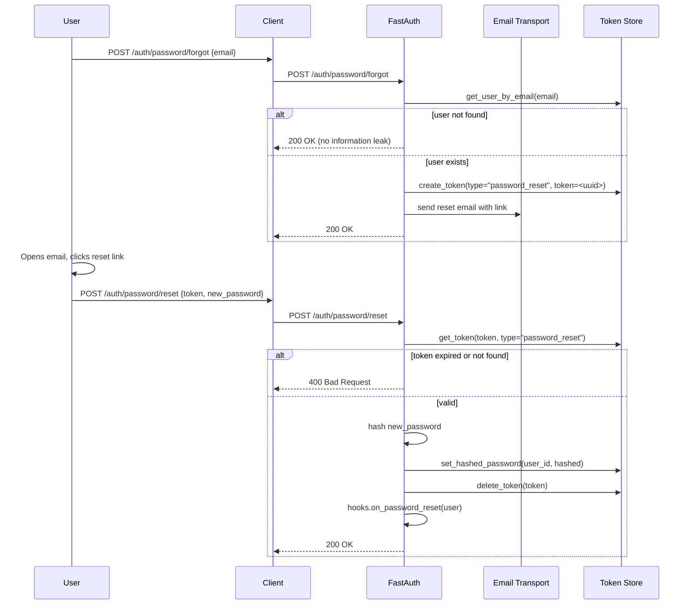

# Password Reset

FastAuth provides a two-step password reset flow: request a reset link via email, then submit a new password with the token from the link.

## Prerequisites

Same as [Email Verification](email-verification.md) — you need a `token_adapter` and `email_transport` configured.

## Flow



## Endpoints

| Method | Path | Body | Description |
|--------|------|------|-------------|
| `POST` | `/auth/password/forgot` | `{"email": "..."}` | Send a reset email |
| `POST` | `/auth/password/reset` | `{"token": "...", "password": "..."}` | Set a new password |

### Request a reset

```bash
curl -X POST http://localhost:8000/auth/password/forgot \
  -H "Content-Type: application/json" \
  -d '{"email": "alice@example.com"}'
```

FastAuth always returns `200 OK` for this endpoint regardless of whether the email exists, to prevent user enumeration.

### Submit a new password

```bash
curl -X POST http://localhost:8000/auth/password/reset \
  -H "Content-Type: application/json" \
  -d '{"token": "<token-from-email>", "password": "newS3cur3P@ss!"}'
```

## Hook

```python
class MyHooks(EventHooks):
    async def on_password_reset(self, user: UserData) -> None:
        await notify_user_of_password_change(user["email"])
```
