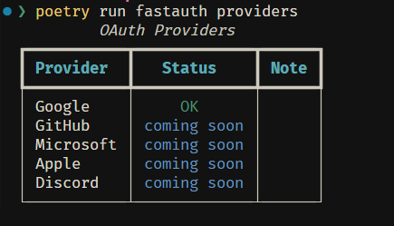

# CLI

FastAuth includes a command-line tool to help you get started quickly.

## Installation

```bash
pip install sreekarnv-fastauth[cli]
```

## Commands

### Check Dependencies

Verify your installation:

```bash
fastauth check
```

Output:


### Initialize Project

Create a new FastAuth project with boilerplate files:

```bash
fastauth init my-app
```

Then run:

```bash
cd my-app
cp .env.example .env
pip install fastapi uvicorn
uvicorn app.main:app --reload
```

Open http://localhost:8000/docs to see your API.

To overwrite existing files:

```bash
fastauth init my-app --force
```

### Generate Secret Key

Generate a secure key for JWT tokens:

```bash
fastauth generate-secret
```

Output:

```
a3f8b2c1d4e5f6789012345678901234567890abcdef1234567890abcdef1234
```

With `.env` format:

```bash
fastauth generate-secret --env
```

Output:

```
SECRET_KEY=a3f8b2c1d4e5f6789012345678901234567890abcdef1234567890abcdef1234
```

Custom length:

```bash
fastauth generate-secret --length 32
```

### List OAuth Providers

See available OAuth providers:

```bash
fastauth providers
```

Output:



### Version

Check your FastAuth version:

```bash
fastauth version
```

### Help

See all commands:

```bash
fastauth --help
```

## Quick Start Example

```bash
pip install sreekarnv-fastauth[cli] fastapi uvicorn

fastauth init my-auth-app
cd my-auth-app
cp .env.example .env

uvicorn app.main:app --reload
```

Visit http://localhost:8000/docs and try:

1. `POST /register` - Create a user
2. `POST /login` - Get access token
3. `GET /me` - View your profile (use the token)
