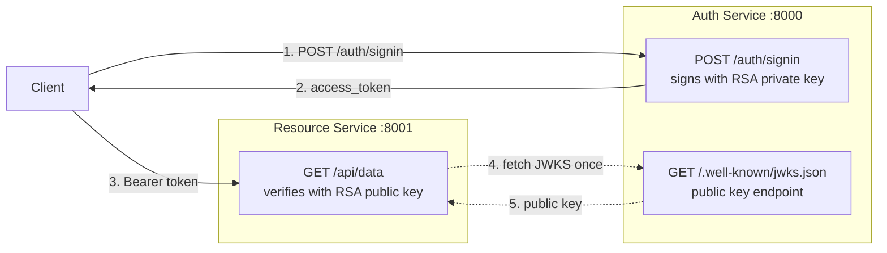

# Guide: Microservice JWT

This guide shows how to use RS256 + JWKS so a resource service can verify FastAuth tokens without sharing the private key, based on `examples/jwt-microservice`.

## The pattern



## Auth service

### Generate keys

```bash
openssl genrsa -out private_key.pem 2048
openssl rsa -in private_key.pem -pubout -out public_key.pem
```

### Configure

```python title="auth_service.py"
from contextlib import asynccontextmanager
from pathlib import Path

from fastapi import FastAPI
from fastauth import FastAuth, FastAuthConfig, JWTConfig
from fastauth.adapters.sqlalchemy import SQLAlchemyAdapter
from fastauth.providers.credentials import CredentialsProvider

_PRIVATE_KEY = Path("private_key.pem").read_text()
_PUBLIC_KEY = Path("public_key.pem").read_text()

adapter = SQLAlchemyAdapter(engine_url="sqlite+aiosqlite:///./auth.db")

config = FastAuthConfig(
    secret="unused-for-rs256-but-required",
    providers=[CredentialsProvider()],
    adapter=adapter.user,
    token_adapter=adapter.token,
    jwt=JWTConfig(
        algorithm="RS256",
        private_key=_PRIVATE_KEY,
        public_key=_PUBLIC_KEY,
        jwks_enabled=True,       # exposes /.well-known/jwks.json
        access_token_ttl=900,
    ),
    base_url="http://localhost:8000",
)

auth = FastAuth(config)


@asynccontextmanager
async def lifespan(app: FastAPI):
    await adapter.create_tables()
    await auth.initialize_jwks()   # required for JWKS mode
    yield


app = FastAPI(title="Auth Service")
auth.mount(app)
```

Run on port 8000:

```bash
uvicorn auth_service:app --port 8000 --reload
```

## Resource service

The resource service fetches the public key from the JWKS endpoint and uses it to verify incoming tokens. It does **not** need the private key.

```python title="resource_service.py"
import httpx
from fastapi import FastAPI, HTTPException, Request, status
from joserfc import jwt
from joserfc.jwk import KeySet

app = FastAPI(title="Resource Service")

_jwks: KeySet | None = None

async def get_jwks() -> KeySet:
    global _jwks
    if _jwks is None:
        async with httpx.AsyncClient() as client:
            response = await client.get("http://localhost:8000/.well-known/jwks.json")
            _jwks = KeySet.import_key_set(response.json())
    return _jwks

async def verify_token(token_str: str) -> dict:
    jwks = await get_jwks()
    try:
        token = jwt.decode(token_str, jwks)
        token.validate()
        return token.claims
    except Exception:
        raise HTTPException(status_code=status.HTTP_401_UNAUTHORIZED)

@app.get("/api/data")
async def protected_data(request: Request):
    auth_header = request.headers.get("Authorization", "")
    if not auth_header.startswith("Bearer "):
        raise HTTPException(status_code=401)
    claims = await verify_token(auth_header[7:])
    return {"user_id": claims["sub"], "data": "secret data"}
```

Run on port 8001:

```bash
uvicorn resource_service:app --port 8001 --reload
```

## Try it

```bash
# Sign in via auth service
TOKEN=$(curl -s -X POST http://localhost:8000/auth/signin \
  -H "Content-Type: application/json" \
  -d '{"email":"alice@example.com","password":"s3cr3t"}' \
  | jq -r .access_token)

# Call resource service with that token
curl http://localhost:8001/api/data \
  -H "Authorization: Bearer $TOKEN"
```

## Key rotation

When `jwks_enabled=True` and `key_rotation_interval` is set, FastAuth generates a new RSA key pair after the interval expires. The old key is kept in the JWKS response during a transition window so in-flight tokens continue to validate.

```python
JWTConfig(
    algorithm="RS256",
    jwks_enabled=True,
    key_rotation_interval=86400,  # rotate every 24 hours
)
```

Resource services should re-fetch the JWKS when they encounter an unknown key ID (`kid`).
