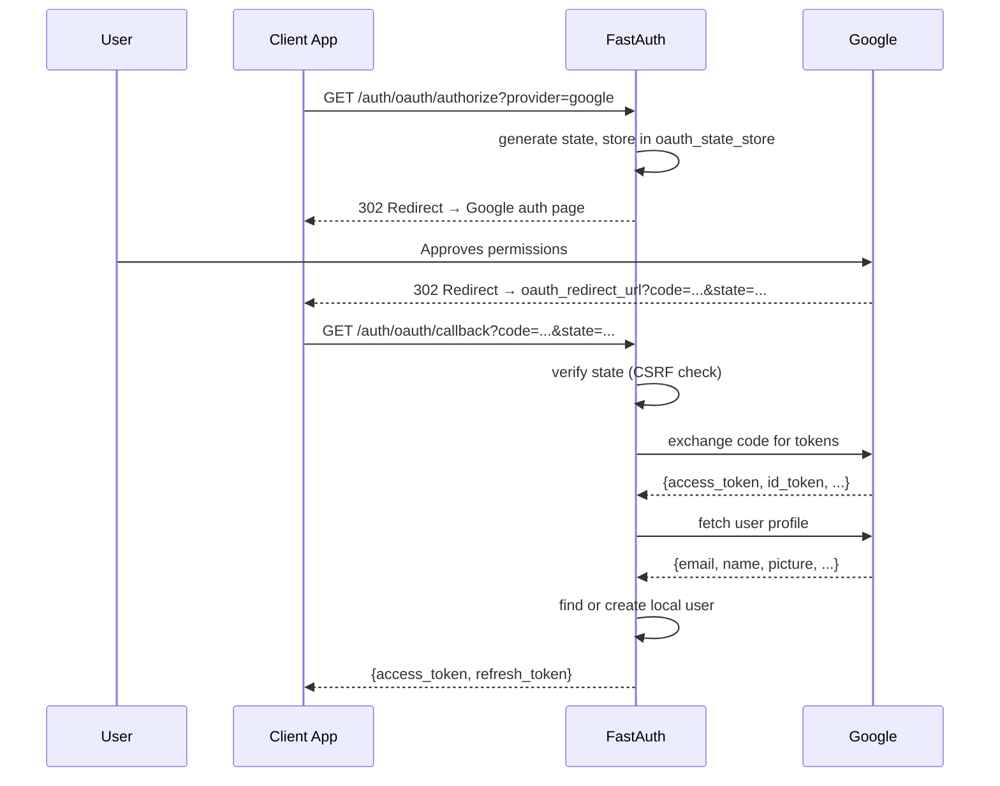

# Google OAuth Provider

Authenticate users with their Google accounts via OAuth 2.0 / OIDC.

## Prerequisites

```bash
pip install "sreekarnv-fastauth[standard,oauth]"
```

Create a Google OAuth 2.0 client in the [Google Cloud Console](https://console.cloud.google.com/):

1. Go to **APIs & Services → Credentials**
2. Click **Create Credentials → OAuth client ID**
3. Application type: **Web application**
4. Add an **Authorized redirect URI**: `https://your-domain.com/auth/oauth/callback`

## Setup

```python
import os
from fastauth.providers.google import GoogleProvider

config = FastAuthConfig(
    providers=[
        GoogleProvider(
            client_id=os.environ["GOOGLE_CLIENT_ID"],
            client_secret=os.environ["GOOGLE_CLIENT_SECRET"],
        ),
    ],
    oauth_adapter=adapter.oauth,
    oauth_state_store=MemorySessionBackend(),   # or RedisSessionBackend
    oauth_redirect_url="https://your-domain.com/auth/oauth/callback",
    ...
)
```

## Flow

1. **Frontend redirects** the user to `/auth/oauth/authorize?provider=google`
2. FastAuth generates a CSRF `state`, stores it, and redirects to Google's auth page
3. Google redirects back to `oauth_redirect_url` with `code` and `state`
4. FastAuth exchanges the code for tokens, fetches the user's Google profile, and either:
   - creates a new local user, or
   - links the Google account to an existing user with the same email
5. FastAuth issues an access + refresh token pair



## Requested scopes

By default the Google provider requests `openid email profile`. This gives FastAuth the user's email address and basic profile information.

## Account linking

If a user with the same email already exists (e.g. they previously signed up with credentials), FastAuth links the Google account to the existing user rather than creating a duplicate.
